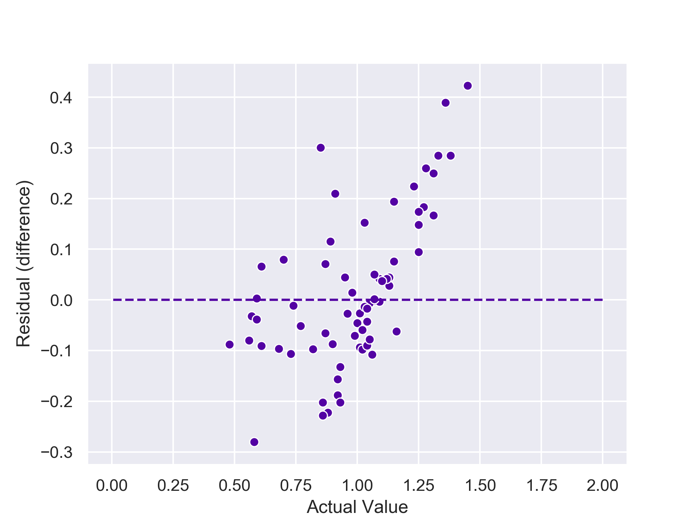

# cebd1160_project_PK
Instructions and template for final projects.

| Name | Date |
|:-------|:---------------|
|Pawel Kaluski | June 15 2019|

-----

### Resources
Your repository should include the following:

- Python script for analysis: Pawe_Kaluski_Final_Project_CEBD1160_wine.py
- Results figure/saved file: 
Graphs/Actual_Predicted/Actual_Predicted.png
Graphs/Actual_ResidualDiff/Actual_ResidualDiff.png
Graphs/ResidualDiff_Distribution/ResidualDiff_Distribution.png
- Dockerfile for your experiment:
- runtime-instructions in a file named RUNME.md

-----

## Research Question

Can we determine the Hue based on the other caracteristics?

### Abstract

- opportunity: wine.data (what data do we have)
- challenge: Diffuculty defining purpose of certain properties. (what is the "problem" we could solve with this dataset)
- action: Run the appropriate algorythm to answer the question. (how will we try to solve this problem/answer this question)
- resolution: Used Linear Regression Model

### Introduction

The wine dataset is composed of 13 different characteristics. (class, alcohol, malic acid, ash, alcalinity of ash, magnesium, total phenols, flavanoids, nonflavanoid phenols, proanthocyanins, color_intensity, hue, od280 od315 of diluted wines and proline) The wines in this dataset are from 3 different regions (represented by the class column). Some of the properties, I known. Other ones are chemicals I never heard. I wanted to build a model that will predict the hue based on the other properties. My starting point was the “scipy cheat sheet” https://scikit-learn.org/stable/tutorial/machine_learning_map/ By process of elimination it led me to use linear regression model with fit.

### Methods

I used pandas to read the wine.dat by setting the separator and defining the column names. Pandas were also used to select the X and the y. X being the data (all fields excluding the target and class) and y, the target (hue). Next I split the dataset in two. One portion is the test and the remaining portion will be used to train my model. I used test size 0.38. next I trained my model using a linear regression with fit. Next, I compared my models predictions to the actual in the test dataset. I printed the residual difference for every actual hue in the test data set. Next, I generated scatter graphs to illustrate actual vs predicted vales and actual to residual difference, and a distribution graph for residual difference distribution.

The reason I chose those methodes was influenced by the “scipy cheat sheet”.

### Results

Brief (2 paragraph) description about your results. Include:

MAE error(avg abs residual): 0.1227137298538843
MSE error: 0.026459679261195926
RMSE error: 0.16266431465197254

### Discussion
Brief (no more than 1-2 paragraph) description about what you did. Include:

- interpretation of whether your method "solved" the problem
- suggested next step that could make it better.

### References
All of the links

-------
